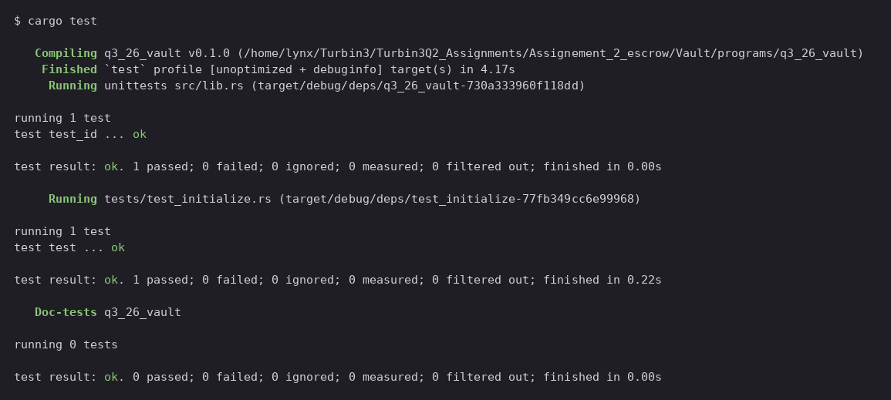

# q3_26_vault

Week 2 assignment for Turbin3 (Q3 2026 cohort), the vault half. A per-user SOL vault as an Anchor program: each user gets their own PDA to park lamports in, and only they can take them back out.

Built on Anchor 1.1.2 and tested against [LiteSVM](https://github.com/LiteSVM/litesvm) rather than a validator, so the suite is a plain `cargo test` with no ledger to spin up.

## The four instructions

| Instruction | What it does |
|---|---|
| `initialize` | Creates the `vault_state` PDA, records both bumps, and funds the vault to the rent exempt minimum |
| `deposit` | Moves `amount` lamports from the user into their vault |
| `withdraw` | Moves `amount` lamports back out, capped at whatever sits above the rent floor |
| `close` | Drains the vault completely and closes `vault_state`, returning all rent to the user |

## Two accounts, two jobs

```
vault_state   PDA, seeds ["state", user]     program owned, stores vault_bump + state_bump
vault         PDA, seeds ["vault", user]     system owned, no data, just holds lamports
```

`vault_state` exists only so later instructions can re-derive the vault without paying for `find_program_address` every time. The vault itself is a bare `SystemAccount`. Because it is a PDA, the program signs on its behalf with `["vault", user, vault_bump]` whenever lamports leave.

## Build and test

The Anchor CLI is not needed. Nothing here consumes the IDL, and the test loads the `.so` directly.

```bash
cargo build-sbf --manifest-path programs/q3_26_vault/Cargo.toml --sbf-out-dir target/deploy
```

```bash
cargo test
```

Build first, always. `tests/test_initialize.rs` does `include_bytes!` on `target/deploy/q3_26_vault.so` at compile time, so a missing or stale build surfaces as a confusing compile error rather than a test failure.

### Proof



## The test

One integration test walks the full lifecycle: `initialize`, `deposit`, `withdraw`, `close`. It checks the balance after every step, and finishes by asserting `vault_state` is gone and the vault balance is exactly zero.

## Notes and gotchas

- **`close = user` works on `vault_state` but not on `vault`.** Anchor's close constraint needs a program owned `Account<T>` with a discriminator. The vault is system owned with no data, so Anchor cannot close it. Its lamports have to be moved out by hand with a system program CPI, and the account stops existing once it hits zero. That is why `close.rs` uses two different mechanisms in one instruction.

- **`close` has to take the rent exempt lamports too.** `initialize` seeds the vault with `Rent::minimum_balance(0)`, and the test asserts the final balance is `0`, not the rent floor. So `close` transfers `self.vault.lamports()`, the whole balance.

- **`withdraw` stops at the rent floor, on purpose.** A system account that drops below rent exemption can be reaped by the runtime. `withdraw` subtracts the rent minimum before deciding what is available and fails with `InsufficientBalance` otherwise. Emptying the vault is `close`'s job, and it closes the account in the same breath.

- **`CpiContext::new` takes a `Pubkey`, not an `AccountInfo`.** In Anchor 1.x the signature is `new(program_id: Pubkey, accounts: T)`, so `self.system_program.key()` is correct. This reads like a bug if you are used to the 0.2x or 0.3x API.

- **Bind the key to a local before building signer seeds.** `self.user.key()` returns a temporary. It has to live in a local for the `[&[&[u8]]; 1]` array to borrow from, or it does not live long enough.

- **The vault PDA is seeded on the user, not on `vault_state`.** Both are common designs. This one means the vault address is derivable from the user key alone, but it also means the signer seeds in `withdraw` and `close` use `user.key()`, not `vault_state.key()`.

## Reference docs

- [Anchor account constraints](https://www.anchor-lang.com/docs/references/account-constraints) for `init`, `seeds`, `bump` and `close`
- [Anchor CPI](https://www.anchor-lang.com/docs/basics/cpi) for `CpiContext` and PDA signing
- [Solana PDAs](https://solana.com/docs/core/pda) for why a program can sign for an address it does not hold a key to
- [LiteSVM](https://litesvm.dev/) for the test harness
