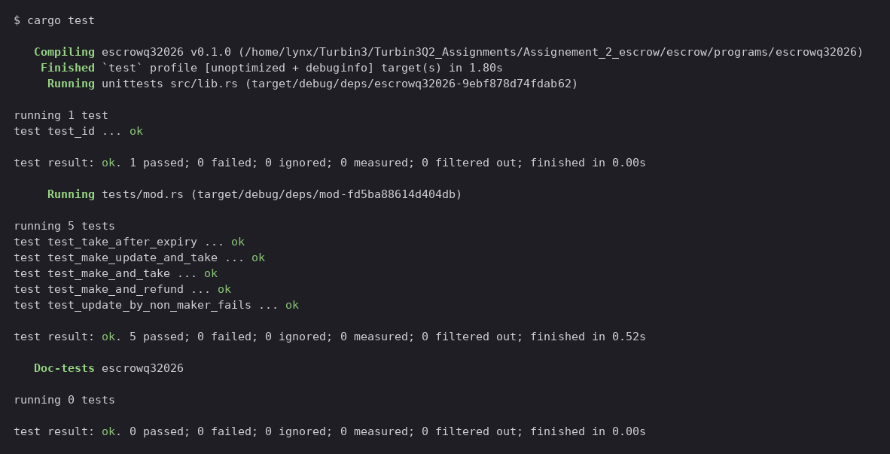
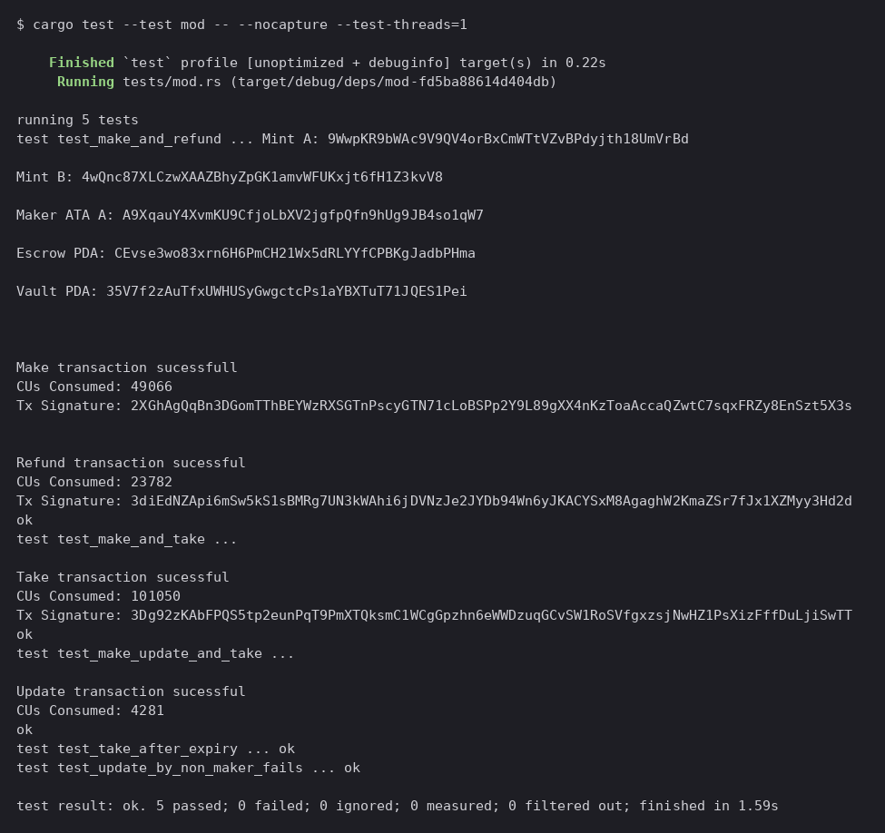

# escrowq32026

Week 2 assignment for Turbin3 (Q3 2026 cohort). An Anchor escrow program: two parties swap SPL tokens atomically, without trusting each other or a third party. The maker locks token A in a program-owned vault and names their price in token B; any taker holding token B can complete the swap in a single transaction. If nobody takes it, the maker can pull their tokens back.

The twist on the standard escrow is an **expiration**. The maker sets a deadline at creation, and `take` refuses once the on-chain clock passes it.

Built on Anchor 1.1.2 with the `token_interface` module throughout, so the program works with both SPL Token and Token-2022 mints. Tested against [LiteSVM](https://github.com/LiteSVM/litesvm) rather than a validator.

## The four instructions

| Instruction | Discriminator | What it does |
|---|---|---|
| `make` | 0 | Creates the escrow PDA, opens the vault ATA, moves `deposit` of token A from the maker into the vault |
| `take` | 1 | Taker sends `receive` of token B to the maker, vault releases token A to the taker, both accounts close |
| `refund` | 2 | Maker reclaims the vault balance and closes the escrow |
| `update` | 3 | Maker re-prices an open trade, and optionally moves the deadline |

Discriminators are set explicitly rather than derived from the instruction name.

```
                       make
  maker_ata_a  ──────────────────────►  vault  (owned by the escrow PDA)

                       take
  taker_ata_b  ──────────────────────►  maker_ata_b
  vault        ──────────────────────►  taker_ata_a
  escrow + vault closed, rent to maker and taker respectively

                       refund
  vault        ──────────────────────►  maker_ata_a
  escrow + vault closed, rent back to maker

                      update
  escrow.receive (and optionally escrow.expiration) rewritten in place
  vault untouched
```

The diagrams these were built from are in [`arch/`](arch/).

## Accounts

The escrow PDA is derived from `["escrow", maker, seed]` and stores everything `take`, `refund` and `update` need to validate themselves:

```rust
pub struct Escrow {
    pub seed: u64,
    pub maker: Pubkey,
    pub mint_a: Pubkey,
    pub mint_b: Pubkey,
    pub receive: u64,
    pub bump: u8,
    pub expiration: i64,
}
```

The vault is just the associated token account of the escrow PDA for mint A. Because the PDA owns it, only the program can move tokens out, and it does so by signing with `["escrow", maker, seed, bump]`.

`take` carries the most accounts of the four, so the mints and token accounts are `Box`ed. Without that, `try_accounts` overflows the 4KB stack frame.

## Build and test

The Anchor CLI isn't needed. Nothing here consumes the IDL, and the tests load the `.so` directly.

```bash
cargo build-sbf --manifest-path programs/escrowq32026/Cargo.toml --sbf-out-dir target/deploy
```

```bash
cargo test
```

Build first, always. `tests/mod.rs` does `include_bytes!` on `target/deploy/escrowq32026.so` at compile time, so a stale or missing `.so` shows up as a confusing compile error rather than a test failure.

The workspace pins `rust-version = "1.89.0"`; `rustup update stable` if `rustc --version` is older.

### Proof

All six tests green:



The same run with `--nocapture`, showing the transactions actually landing and what each one costs:



| Instruction | CUs |
|---|---|
| `make` | 49,066 |
| `take` | 101,050 |
| `refund` | 23,782 |
| `update` | 4,281 |

`take` is by far the most expensive. It creates two ATAs, moves tokens twice and closes an account, all in one instruction. `update` is the cheapest because it only rewrites two fields on an account that already exists.

## The tests

| Test | Covers |
|---|---|
| `test_make_and_refund` | Maker deposits, then pulls out. Asserts the vault balance and escrow fields after `make`, and that both accounts are gone after `refund`. |
| `test_make_and_take` | The full swap. Asserts the taker ends up with token A, the maker with token B, and that escrow and vault are both closed. |
| `test_take_after_expiry` | Pushes the clock past the deadline and asserts `take` fails with `EscrowExpired`, with nothing moved. |
| `test_make_update_and_take` | Re-prices an open trade, then takes it. Asserts the taker paid the new price, not the original one. |
| `test_update_by_non_maker_fails` | A non-maker tries to re-price someone else's escrow and is rejected, with the original terms intact. |

The four take and update tests share a `setup_escrow` helper that builds two mints, funds a maker and a taker, and runs `make`.

## Notes and gotchas

- **`CpiContext::new` takes a `Pubkey`, not an `AccountInfo`.** In Anchor 1.x the signature is `new(program_id: Pubkey, accounts: T)`, so `self.token_program.key()` is correct. This reads like a bug if you're used to the 0.2x/0.3x API, where you passed the program's `AccountInfo`.

- **LiteSVM's clock starts at zero.** The obvious way to test expiry, setting `expiration: 1` and expecting a failure, doesn't work, because the default `unix_timestamp` is `0` and `0 <= 1` passes. `test_take_after_expiry` reads the sysvar, then pushes it forward with `svm.set_sysvar::<Clock>()`.

- **The expiry check lives in the accounts struct**, as a `constraint` on `escrow`, not in the handler. It fires during `try_accounts`, so it rejects before any CPI runs.

- **`ErrorCode` needs an explicit import.** `lib.rs` re-exports `constants`, `instructions` and `state` but not `error`, so the prelude glob gives you Anchor's built-in `ErrorCode` instead of yours. `use crate::error::ErrorCode;` shadows it.

- **`take` closes the vault to the taker, `refund` closes it to the maker.** The taker paid the rent for the two ATAs that `take` creates, so it gets the vault's rent back. The escrow account's own rent goes to the maker in both paths.

- **Borrow lifetimes in the signer seeds.** `self.maker.key()` and `self.escrow.seed.to_le_bytes()` both produce temporaries. They have to be bound to locals before going into the `[&[&[u8]]; 1]` array, or they don't live long enough.

- **`update` refuses to revive an expired escrow.** It carries the same expiration constraint as `take`, so once the deadline passes the maker's only route is `refund`. Letting a lapsed trade be quietly re-priced back into life would surprise a taker who had already checked the deadline and walked away.

- **`expiration` on `update` is an `Option<i64>`.** Passing `None` leaves the existing deadline alone, so a plain re-price does not have to restate it.

- **`init_if_needed` is deliberate.** `take` creates `taker_ata_a` and `maker_ata_b` because neither party is guaranteed to hold the token they're about to receive. It requires the `init-if-needed` feature on `anchor-lang`.

## Reference docs

- [Anchor account constraints](https://www.anchor-lang.com/docs/references/account-constraints) for `init_if_needed`, `close`, `has_one` and `constraint`
- [Anchor CPI](https://www.anchor-lang.com/docs/basics/cpi) for `CpiContext` and PDA signing
- [`anchor_spl::token_interface`](https://docs.rs/anchor-spl/latest/anchor_spl/token_interface/) for the Token-2022-compatible wrappers
- [LiteSVM](https://litesvm.dev/) for the test harness, including the time-travel section
