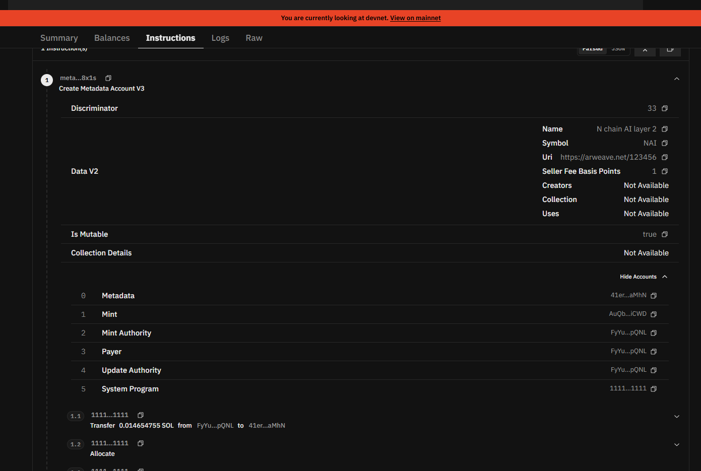
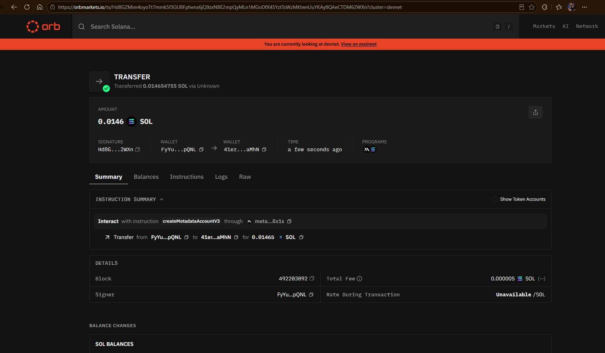
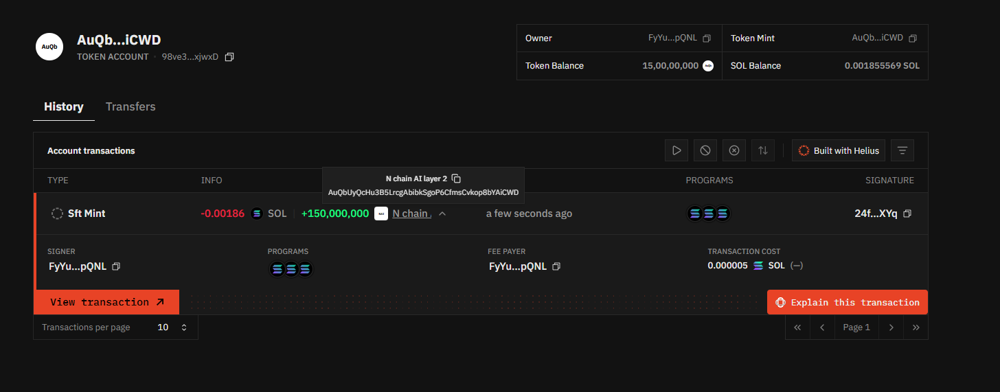
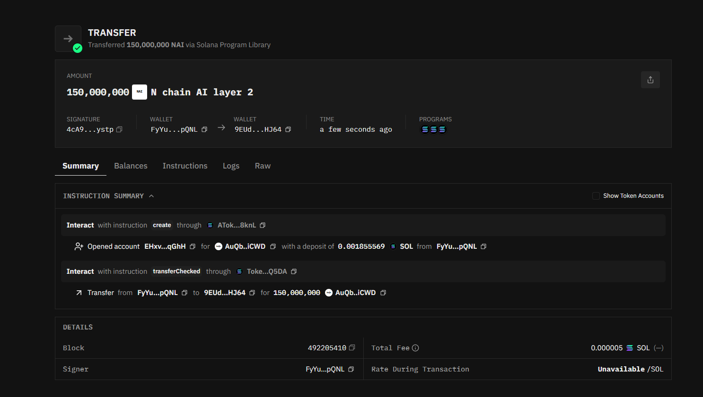
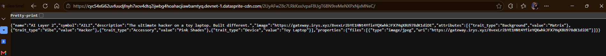
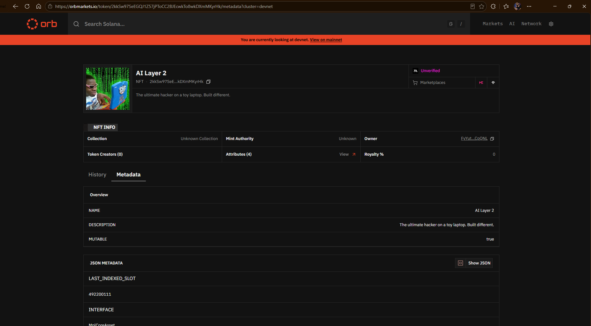
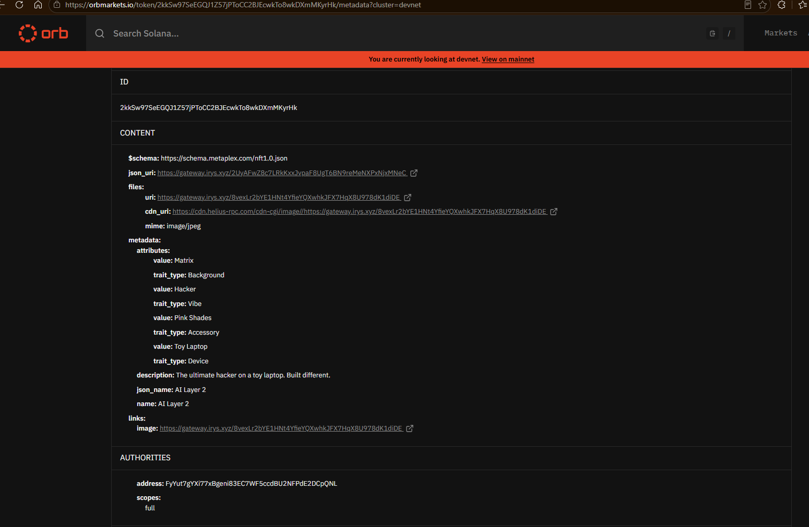
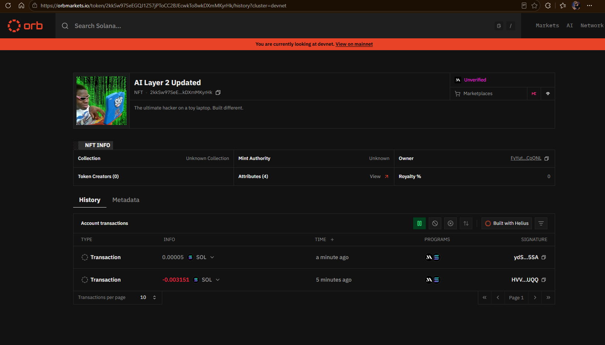

# spl-nft-q326

Week 1 assignment for Turbin3 (Q3 2026 cohort). A set of TypeScript scripts that create an SPL token, mint and transfer it, then mint an NFT with MPL Core and rename it as the update authority. Everything runs on devnet.

Built with [@solana/kit](https://www.solanakit.com/) for the raw transaction work and UMI + Metaplex for anything metadata related.

## What's here

| Assignment task | Scripts | Status |
|---|---|---|
| 1. Mint and transfer your own SPL token | `spl_init` → `spl_metadata` → `spl_mint` → `spl_transfer` | done |
| 2. Mint an NFT using MPL Core | `nft_image` → `nft_metadata` → `nft_mint` | done |
| 3. Update the NFT name and metadata as update authority | `nft_update` | done |
| 4 & 5 (extension) | NFT transfer and burn | not attempted |

## Setup

### 1. Wallet

Drop your devnet keypair at the project root as `devnet-wallet.json`. It's just the raw JSON byte array, like `[174, 23, ...]`.

```
spl-nft-q326/
├── devnet-wallet.json   <- here
└── src/
```

It's already in `.gitignore`, so it won't get committed. Make sure it has some devnet SOL, the Irys uploads and account rent add up.

### 2. Install

```bash
npm install
```

### 3. Env file

`nft_image.ts` reads its config from a file called `e.env` at the root:

```
IMAGE_PATH=./AILAYER2.jpg
SOLANA_RPC_URL=https://api.devnet.solana.com
```

`IMAGE_PATH` is required, the script throws if it's missing. `SOLANA_RPC_URL` is optional everywhere, it falls back to the public devnet endpoint.

## Part 1: the SPL token

Run these in order. Each one prints an address or signature you paste into the next script before running it.

| Step | Command | What it does |
|---|---|---|
| 1 | `npm run spl:init` | Creates the mint account (0 decimals) and prints the mint address |
| 2 | `npm run spl:metadata` | Attaches name, symbol and URI to the mint via Token Metadata |
| 3 | `npm run spl:mint` | Derives your ATA, creates it, and mints tokens into it |
| 4 | `npm run spl:transfer` | Creates the recipient's ATA and sends tokens over |

The token I ended up with:

- Mint: `AuQbUyQcHu3B5LrcgAbibkSgoP6CfmsCvkop8bYAiCWD`
- Name / symbol: N chain AI layer 2 / NAI
- Decimals: 0
- Supply minted: 150,000,000

### Proof

`createMetadataAccountV3` going through, with the name, symbol and URI written on chain:



The same transaction from the summary view:



Token account after minting, balance sitting at 150,000,000:



And the transfer out to `9EUd4VNcjMAysd7zQk3Q1a4tb28BYndLNBAQDiYnHJ64`. You can see the ATA getting opened first and then the `transferChecked` in the same transaction:



## Part 2: the NFT

Same idea, run in order and carry the URI forward each time.

| Step | Command | What it does |
|---|---|---|
| 1 | `npm run nft:image` | Uploads the image to Irys, prints the image URI |
| 2 | `npm run nft:metadata` | Builds the metadata JSON (name, description, traits) and uploads it, prints the metadata URI |
| 3 | `npm run nft:mint` | Mints the Core asset on chain using that metadata URI, prints the asset address |
| 4 | `npm run nft:update` | Updates the asset name as the update authority |

What I minted:

- Asset: `2kkSw97SeEGQJ1Z57jPToCC2BJEcwkTo8wkDXmMKyrHk`
- Image URI: `https://gateway.irys.xyz/8vexLr2bYE1HNt4YfieYQXwhkJFX7HqX8U978dK1diDE`
- Metadata URI: `https://gateway.irys.xyz/2UyAFwZ8c7LRkKxxJvpaF8UgT6BN9reMeNXPxNjxMNeC`
- Name: AI Layer 2, later updated to AI Layer 2 Updated

### Proof

Image live on the Irys gateway after upload:


The metadata JSON that got uploaded, pointing at that image:



The minted asset on the explorer:



Metadata as the indexer reads it back, traits and authority included:



After running `nft:update`, the name is now "AI Layer 2 Updated" and there's a second transaction in the history:



## Notes and gotchas

- **Decimals have to match.** The mint is created with 0 decimals, so `spl_transfer.ts` passes `decimals: 0` to `transferChecked`. If those two disagree the transfer fails, and the error message is not obvious about why.
- **Paste addresses forward.** Nothing is persisted between scripts. `spl_metadata`, `spl_mint` and `spl_transfer` all have a hardcoded mint constant near the top, and the NFT scripts have hardcoded URIs and an asset address. Update them after each run.
- **Irys needs funding.** The uploader pulls from the same devnet wallet, so an empty wallet fails at the upload step rather than the mint step.
- **Only `nft_image.ts` loads dotenv.** The other scripts read `SOLANA_RPC_URL` straight off `process.env`, so if you want a custom RPC for those, export it in your shell instead of relying on `e.env`.
- **Core assets are not SPL mints.** MPL Core assets are a single account, so there's no mint, no ATA and no token account to think about. That's why the NFT flow is shorter than the SPL one.

## Reference docs

- [Solana token docs](https://solana.com/docs/tokens) for mint accounts, token accounts and ATAs
- [Solana Kit](https://www.solanakit.com/) for building and sending transactions
- [Metaplex Token Metadata](https://www.metaplex.com/docs/smart-contracts/token-metadata) for the SPL metadata account
- [Metaplex Core](https://www.metaplex.com/docs/smart-contracts/core) for the NFT standard
- [Core JSON schema](https://www.metaplex.com/docs/smart-contracts/core/json-schema) for the metadata format
